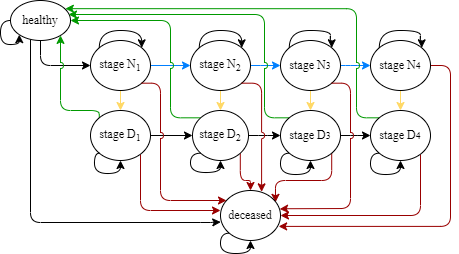

# BC-MM
Breast Cancer Markov Model for simulating the impact of COVID-19 on disease costs in Poland:


To install the required dependencies:

```shell
pip install -r requirements.txt
```

You can turn on and off COVID with the following flag in config.py:
```python
IS_COVID_SIMULATION = False
```

To run 100 simulations:
```shell
cd src
python multiple_executions.py
```

To run 1 simulation:
```shell
cd src
python main.py
```

Results of the simulation will be stored in the "output" folder.